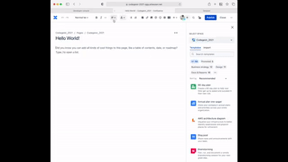

# [Get the Meme Generator App on Atlassian -> Click Me✅](https://developer.atlassian.com/console/install/5f542190-4539-464e-8102-f1d6460e38c1?signature=e5fa0f648990ab876c22e5981f84a55659bdb63e321bcfee760bcfbaa4590f95&product=confluence)




## Inspiration
Everyone need a sense of humour in daily life. 

## What it does
Simply use slash command "/Random Dev Meme Generator" to get a randomly generated developer meme! Enjoy! 

See [developer.atlassian.com/platform/forge/](https://developer.atlassian.com/platform/forge) for documentation and tutorials explaining Forge.

## Requirements

See [Set up Forge](https://developer.atlassian.com/platform/forge/set-up-forge/) for instructions to get set up.

## Quick start

- Modify your app by editing the `src/index.tsx` file.

- Build and deploy your app by running:
```
forge deploy
```

- Install your app in an Atlassian site by running:
```
forge install
```

- Develop your app by running `forge tunnel` to proxy invocations locally:
```
forge tunnel
```

### Notes
- Use the `forge deploy` command when you want to persist code changes.
- Use the `forge install` command when you want to install the app on a new site.
- Once the app is installed on a site, the site picks up the new app changes you deploy without needing to rerun the install command.

## Support

See [Get help](https://developer.atlassian.com/platform/forge/get-help/) for how to get help and provide feedback.
